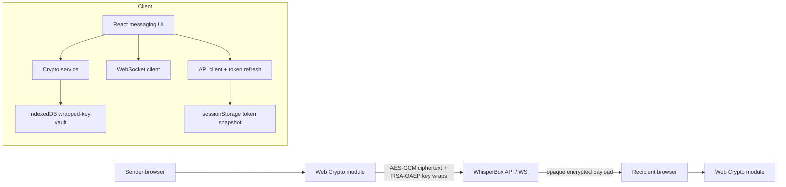

# WhisperBox E2EE Client

**Conclusion:** this client implements the WhisperBox hybrid E2EE protocol in the browser: plaintext is encrypted before it leaves the device, the backend receives only encrypted message payloads, and the RSA private key is never stored as raw plaintext.

## Run locally

```bash
npm install
npm run dev
```

Optional API override:

```bash
VITE_API_BASE_URL=https://whisperbox.koyeb.app npm run dev
```

## Architecture



## Requirement Variables

| Variable | Decision |
| --- | --- |
| Platform | Browser SPA using React + Vite |
| Crypto primitive | Web Crypto API |
| Message encryption | AES-GCM 256-bit key per message, 96-bit random IV |
| Key exchange | RSA-OAEP public keys from WhisperBox API |
| Private key storage | AES-KW wrapped private key in IndexedDB and backend profile |
| Raw private key lifetime | In memory only, re-unlocked with password after reload |
| Transport | WebSocket for live messages, REST `/messages` fallback |

## Encryption Flow

1. Registration generates an RSA-OAEP key pair in the browser.
2. The public key is exported as base64 SPKI and sent to the backend.
3. The private key is wrapped locally using AES-KW. Because Web Crypto AES-KW requires 64-bit aligned input, the client wraps a padded opaque PKCS8 byte container and imports the RSA key after unwrap.
4. The AES-KW key is derived from the user password with PBKDF2-SHA-256 and a random 128-bit salt.
5. Sending a message generates a fresh AES-GCM key and IV.
6. The plaintext is encrypted with AES-GCM.
7. The AES key is encrypted twice with RSA-OAEP: once for the recipient and once for the sender.
8. The backend stores only `ciphertext`, `iv`, `encryptedKey`, and `encryptedKeyForSelf`.
9. Receiving decrypts the correct encrypted AES key with the in-memory private key, then decrypts the message body with AES-GCM.

## Key Management

| Key material | Where it lives | Notes |
| --- | --- | --- |
| Public key | Backend, session profile, IndexedDB cache | Safe to share |
| Wrapped private key | Backend profile and IndexedDB | Encrypted with password-derived AES-KW key |
| Raw private key | Browser memory only | Non-extractable after unwrap |
| Password | Form field only | Not stored |
| Access token | `sessionStorage` | Short-lived; refreshed on 401 |
| Refresh token | `sessionStorage` | Practical tradeoff because API uses bearer tokens, not HttpOnly cookies |

## Trade-offs

| Trade-off | Choice | Why |
| --- | --- | --- |
| Build vs buy | Use Web Crypto directly | Avoids shipping custom crypto and matches the API guide |
| Simplicity vs forward secrecy | RSA-OAEP hybrid encryption | Fits backend contract; does not implement Signal-style ratchets |
| UX vs token hardening | `sessionStorage` tokens | Survives reloads within a tab; still vulnerable to XSS, so CSP and dependency hygiene matter |
| Speed vs brute-force cost | PBKDF2 at 310,000 iterations | Reasonable browser latency with materially better password wrapping than low iteration counts |
| Live delivery vs resilience | WebSocket first, REST fallback | Messages remain sendable when the socket is unavailable |

## Failure Modes

| Scenario | Behavior |
| --- | --- |
| Wrong password on unlock | Private key unwrap fails and the UI keeps the session locked |
| Token expires | API client refreshes access token and retries once |
| WebSocket disconnects | UI marks fallback mode and sends through REST |
| Malformed encrypted payload | Message shows a decryption failure state, not broken UI |
| IndexedDB unavailable | App still works from server-returned wrapped key material |
| 10x message history | Current client decrypts one page at a time; older pagination should remain cursor-based |

## Known Limitations

- No forward secrecy or double-ratchet protocol.
- No explicit replay-protection counter beyond backend timestamps and AES-GCM integrity.
- No manual safety-number / public-key verification UI.
- No hardened CSP is configured in this frontend scaffold.
- Browser JavaScript cannot protect bearer tokens from a successful XSS attack.
- WebSocket send acknowledgements are inferred optimistically because the docs do not define an ACK frame.

## Validation

```bash
npm run test
npm run build
```

The crypto test verifies private-key wrapping/unwrapping and recipient plus sender decryption paths.
