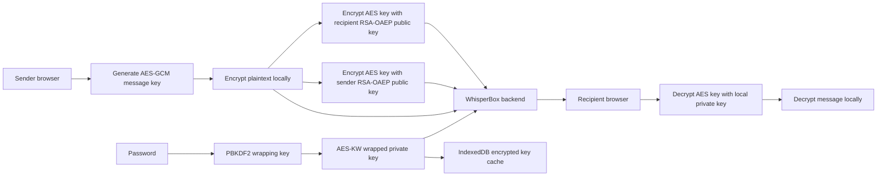

# WhisperBox E2EE Client

A secure messaging web client for the WhisperBox API at `https://whisperbox.koyeb.app/`. Encryption and decryption happen in the browser with the Web Crypto API, so the backend stores only ciphertext and encrypted key material.

## Run Locally

```bash
npm install
npm run dev
```

Build check:

```bash
npm run build
```

## Architecture



## Encryption Flow

1. Registration generates an RSA-OAEP key pair in the browser.
2. The public key is exported and sent to the backend.
3. The private key is wrapped with AES-KW. The AES-KW key is derived from the user password using PBKDF2-SHA-256 and a random 128-bit salt.
4. Sending a message creates a fresh AES-GCM-256 key and 96-bit IV.
5. The plaintext is wrapped in a small encrypted envelope containing the body, timestamp, version, and nonce.
6. The AES key is encrypted twice: once for the recipient and once for the sender.
7. The server receives only `ciphertext`, `iv`, `encryptedKey`, and `encryptedKeyForSelf`.
8. Recipients decrypt the AES key with their local RSA private key, then decrypt the AES-GCM ciphertext.

## Key Management

- Raw private keys are never sent to the backend.
- Raw private keys are not written to `localStorage`, `sessionStorage`, or IndexedDB.
- The backend stores only the public key, PBKDF2 salt, and AES-KW wrapped private key.
- IndexedDB caches the same wrapped key material so the device can restore state without storing plaintext keys.
- The unwrapped private key lives only in memory for the active browser session.
- Access and refresh tokens are stored in `sessionStorage`, not `localStorage`, and are cleared on logout.

## API Use

- `POST /auth/register` receives client-generated key material.
- `POST /auth/login` returns wrapped key material for local unlock.
- `GET /users/search` and `GET /users/{id}/public-key` find recipients and fetch public keys.
- `wss://whisperbox.koyeb.app/ws?token=<token>` is used for real-time delivery.
- `POST /messages` is used as the offline fallback when the socket is unavailable.
- `GET /conversations` and `GET /conversations/{id}/messages` load encrypted history.

## Security Trade-offs

- This implementation uses long-term RSA-OAEP identity keys. It does not provide full forward secrecy if a user's private key and historical ciphertext are later compromised.
- Public keys are trusted from the authenticated backend. A production-grade messenger should add out-of-band fingerprint verification or key transparency.
- The encrypted envelope includes a nonce, and the client flags duplicate sender nonces during the active session as a replay warning. Persistent replay tracking would need a privacy-preserving local store.
- Tokens in `sessionStorage` reduce persistence compared with `localStorage`, but strong XSS prevention is still required.
- PBKDF2 iterations are a client convention because the API stores only the salt. This client uses 310,000 PBKDF2-SHA-256 iterations.
- Web Crypto requires HTTPS, except on localhost during development.

## Known Limitations

- WebSocket sends are optimistically rendered. If the server rejects a socket frame after send, the UI may need a later reconciliation pass.
- No attachment encryption is implemented.
- No multi-device key sync is implemented.
- No manual safety-number comparison UI is implemented yet.
- Message search is intentionally not implemented because the server cannot read plaintext.
